泰坦尼克号是当时（1912年）世界上体积最庞大、内部设施最豪华的客运轮船，有“永不沉没”的美誉 。然而在首次航行中，泰坦尼克号与一座冰山相撞，逾1500人丧生，其中仅333具罹难者遗体被寻回。泰坦尼克号沉没事故为和平时期死伤人数最惨重的海难之一，其残骸直至1985年才被再度发现，目前受到联合国教育、科学及文化组织的保护。本次竞赛以此为背景，根据提供的乘客数据来预测这些乘客能否生还（当然真实的情况要比这复杂得多）。

```python
import pandas as pd
import numpy as np
import matplotlib.pyplot as plt
import seaborn as sns
import os

import warnings
warnings.filterwarnings('ignore')

%matplotlib inline
import matplotlib
matplotlib.rcParams['axes.unicode_minus']=False

```

## 导入数据

```python
titanic = pd.read_csv(r'E:\DataScience\ML\Titanic\train.csv')

titanic_test = pd.read_csv(r'E:\DataScience\ML\Titanic\test.csv')

titanic.head(10)
```

<div>
<style scoped>
    .dataframe tbody tr th:only-of-type {
        vertical-align: middle;
    }

    .dataframe tbody tr th {
        vertical-align: top;
    }

    .dataframe thead th {
        text-align: right;
    }
</style>
<table border="1" class="dataframe">
  <thead>
    <tr style="text-align: right;">
      <th></th>
      <th>PassengerId</th>
      <th>Survived</th>
      <th>Pclass</th>
      <th>Name</th>
      <th>Sex</th>
      <th>Age</th>
      <th>SibSp</th>
      <th>Parch</th>
      <th>Ticket</th>
      <th>Fare</th>
      <th>Cabin</th>
      <th>Embarked</th>
    </tr>
  </thead>
  <tbody>
    <tr>
      <th>0</th>
      <td>1</td>
      <td>0</td>
      <td>3</td>
      <td>Braund, Mr. Owen Harris</td>
      <td>male</td>
      <td>22.0</td>
      <td>1</td>
      <td>0</td>
      <td>A/5 21171</td>
      <td>7.2500</td>
      <td>NaN</td>
      <td>S</td>
    </tr>
    <tr>
      <th>1</th>
      <td>2</td>
      <td>1</td>
      <td>1</td>
      <td>Cumings, Mrs. John Bradley (Florence Briggs Th...</td>
      <td>female</td>
      <td>38.0</td>
      <td>1</td>
      <td>0</td>
      <td>PC 17599</td>
      <td>71.2833</td>
      <td>C85</td>
      <td>C</td>
    </tr>
    <tr>
      <th>2</th>
      <td>3</td>
      <td>1</td>
      <td>3</td>
      <td>Heikkinen, Miss. Laina</td>
      <td>female</td>
      <td>26.0</td>
      <td>0</td>
      <td>0</td>
      <td>STON/O2. 3101282</td>
      <td>7.9250</td>
      <td>NaN</td>
      <td>S</td>
    </tr>
    <tr>
      <th>3</th>
      <td>4</td>
      <td>1</td>
      <td>1</td>
      <td>Futrelle, Mrs. Jacques Heath (Lily May Peel)</td>
      <td>female</td>
      <td>35.0</td>
      <td>1</td>
      <td>0</td>
      <td>113803</td>
      <td>53.1000</td>
      <td>C123</td>
      <td>S</td>
    </tr>
    <tr>
      <th>4</th>
      <td>5</td>
      <td>0</td>
      <td>3</td>
      <td>Allen, Mr. William Henry</td>
      <td>male</td>
      <td>35.0</td>
      <td>0</td>
      <td>0</td>
      <td>373450</td>
      <td>8.0500</td>
      <td>NaN</td>
      <td>S</td>
    </tr>
    <tr>
      <th>5</th>
      <td>6</td>
      <td>0</td>
      <td>3</td>
      <td>Moran, Mr. James</td>
      <td>male</td>
      <td>NaN</td>
      <td>0</td>
      <td>0</td>
      <td>330877</td>
      <td>8.4583</td>
      <td>NaN</td>
      <td>Q</td>
    </tr>
    <tr>
      <th>6</th>
      <td>7</td>
      <td>0</td>
      <td>1</td>
      <td>McCarthy, Mr. Timothy J</td>
      <td>male</td>
      <td>54.0</td>
      <td>0</td>
      <td>0</td>
      <td>17463</td>
      <td>51.8625</td>
      <td>E46</td>
      <td>S</td>
    </tr>
    <tr>
      <th>7</th>
      <td>8</td>
      <td>0</td>
      <td>3</td>
      <td>Palsson, Master. Gosta Leonard</td>
      <td>male</td>
      <td>2.0</td>
      <td>3</td>
      <td>1</td>
      <td>349909</td>
      <td>21.0750</td>
      <td>NaN</td>
      <td>S</td>
    </tr>
    <tr>
      <th>8</th>
      <td>9</td>
      <td>1</td>
      <td>3</td>
      <td>Johnson, Mrs. Oscar W (Elisabeth Vilhelmina Berg)</td>
      <td>female</td>
      <td>27.0</td>
      <td>0</td>
      <td>2</td>
      <td>347742</td>
      <td>11.1333</td>
      <td>NaN</td>
      <td>S</td>
    </tr>
    <tr>
      <th>9</th>
      <td>10</td>
      <td>1</td>
      <td>2</td>
      <td>Nasser, Mrs. Nicholas (Adele Achem)</td>
      <td>female</td>
      <td>14.0</td>
      <td>1</td>
      <td>0</td>
      <td>237736</td>
      <td>30.0708</td>
      <td>NaN</td>
      <td>C</td>
    </tr>
  </tbody>
</table>
</div>

| 单词 | 翻译 |Key
|:------:|------:|:---:|
|survival|是否幸存| 0 = No, 1 = Yes|
|pclass| 社会阶层 | 1 = 精英, 2 = 中层 , 3 = 普通民众|
|sex| 性别|
|Age| 年龄|
|sibsp| 船上兄弟/姐妹的个数 |
|parch| 船上父母/孩子的个数 |
|ticket| 船票号 |
|fare| 船票价格 |
|cabin| 船舱号码 |
|embarked| 登船口 | C = Cherbourg, Q = Queenstown, S = Southampton|

```python
# 查看数据简单的统计

titanic.describe()
```

<div>
<style scoped>
    .dataframe tbody tr th:only-of-type {
        vertical-align: middle;
    }

    .dataframe tbody tr th {
        vertical-align: top;
    }

    .dataframe thead th {
        text-align: right;
    }
</style>
<table border="1" class="dataframe">
  <thead>
    <tr style="text-align: right;">
      <th></th>
      <th>PassengerId</th>
      <th>Survived</th>
      <th>Pclass</th>
      <th>Age</th>
      <th>SibSp</th>
      <th>Parch</th>
      <th>Fare</th>
    </tr>
  </thead>
  <tbody>
    <tr>
      <th>count</th>
      <td>891.000000</td>
      <td>891.000000</td>
      <td>891.000000</td>
      <td>714.000000</td>
      <td>891.000000</td>
      <td>891.000000</td>
      <td>891.000000</td>
    </tr>
    <tr>
      <th>mean</th>
      <td>446.000000</td>
      <td>0.383838</td>
      <td>2.308642</td>
      <td>29.699118</td>
      <td>0.523008</td>
      <td>0.381594</td>
      <td>32.204208</td>
    </tr>
    <tr>
      <th>std</th>
      <td>257.353842</td>
      <td>0.486592</td>
      <td>0.836071</td>
      <td>14.526497</td>
      <td>1.102743</td>
      <td>0.806057</td>
      <td>49.693429</td>
    </tr>
    <tr>
      <th>min</th>
      <td>1.000000</td>
      <td>0.000000</td>
      <td>1.000000</td>
      <td>0.420000</td>
      <td>0.000000</td>
      <td>0.000000</td>
      <td>0.000000</td>
    </tr>
    <tr>
      <th>25%</th>
      <td>223.500000</td>
      <td>0.000000</td>
      <td>2.000000</td>
      <td>20.125000</td>
      <td>0.000000</td>
      <td>0.000000</td>
      <td>7.910400</td>
    </tr>
    <tr>
      <th>50%</th>
      <td>446.000000</td>
      <td>0.000000</td>
      <td>3.000000</td>
      <td>28.000000</td>
      <td>0.000000</td>
      <td>0.000000</td>
      <td>14.454200</td>
    </tr>
    <tr>
      <th>75%</th>
      <td>668.500000</td>
      <td>1.000000</td>
      <td>3.000000</td>
      <td>38.000000</td>
      <td>1.000000</td>
      <td>0.000000</td>
      <td>31.000000</td>
    </tr>
    <tr>
      <th>max</th>
      <td>891.000000</td>
      <td>1.000000</td>
      <td>3.000000</td>
      <td>80.000000</td>
      <td>8.000000</td>
      <td>6.000000</td>
      <td>512.329200</td>
    </tr>
  </tbody>
</table>
</div>

```python
# 查看数据概要

titanic.info()
```

    <class 'pandas.core.frame.DataFrame'>
    RangeIndex: 891 entries, 0 to 890
    Data columns (total 12 columns):
    PassengerId    891 non-null int64
    Survived       891 non-null int64
    Pclass         891 non-null int64
    Name           891 non-null object
    Sex            891 non-null object
    Age            714 non-null float64
    SibSp          891 non-null int64
    Parch          891 non-null int64
    Ticket         891 non-null object
    Fare           891 non-null float64
    Cabin          204 non-null object
    Embarked       889 non-null object
    dtypes: float64(2), int64(5), object(5)
    memory usage: 83.6+ KB

从上可以看出，Age,Cabin,Fare,Embarked几个特征存在空值

```python
# 统计空值

print(titanic.isnull().sum())

```

    PassengerId      0
    Survived         0
    Pclass           0
    Name             0
    Sex              0
    Age            177
    SibSp            0
    Parch            0
    Ticket           0
    Fare             0
    Cabin          687
    Embarked         2
    dtype: int64

## 数据清洗

### 处理缺失值

```python
# 可以填充整个dataframe的空值
# titanic.fillna(0)

# 也可以单独填充一列
# titanic.Age.fillna(0)

titanic.Age.fillna(-30, inplace=True)

#查看为空的数据
titanic.isnull().sum()
```

    PassengerId      0
    Survived         0
    Pclass           0
    Name             0
    Sex              0
    Age              0
    SibSp            0
    Parch            0
    Ticket           0
    Fare             0
    Cabin          687
    Embarked         2
    dtype: int64

## 数据分析

### 性别Sex对生还与否的影响

```python
# 做简单是汇总统计
titanic.groupby(['Sex','Survived'])['Survived'].count()
```

    Sex     Survived
    female  0            81
            1           233
    male    0           468
            1           109
    Name: Survived, dtype: int64

```python
# 生还率统计

df_sex = titanic[['Sex','Survived']].groupby(['Sex']).mean()
df_sex
```

<div>
<style scoped>
    .dataframe tbody tr th:only-of-type {
        vertical-align: middle;
    }

    .dataframe tbody tr th {
        vertical-align: top;
    }

    .dataframe thead th {
        text-align: right;
    }
</style>
<table border="1" class="dataframe">
  <thead>
    <tr style="text-align: right;">
      <th></th>
      <th>Survived</th>
    </tr>
    <tr>
      <th>Sex</th>
      <th></th>
    </tr>
  </thead>
  <tbody>
    <tr>
      <th>female</th>
      <td>0.742038</td>
    </tr>
    <tr>
      <th>male</th>
      <td>0.188908</td>
    </tr>
  </tbody>
</table>
</div>

```python
# 绘制柱状图

df_sex.plot(kind='bar',
            figsize=(8,6),
            rot=0,
            fontsize=18,
            stacked=True)
plt.grid(True, linestyle='--')
```

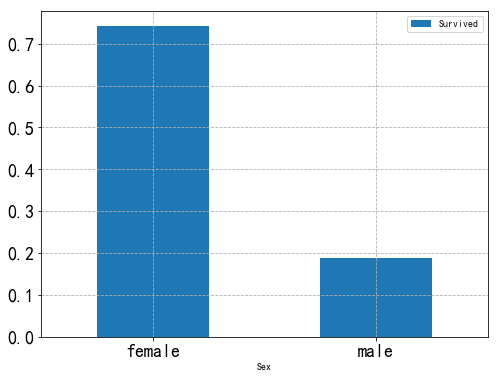

**从上面可以发现，事实是与男性比女性的生存能力更强的经验常识相悖的，可以推测Lady First起到了很大的作用**

### 社会阶层 Pclass与生还与否的关系

```python
# 统计
titanic.groupby(['Pclass', 'Survived'])['Pclass'].count()
```

    Pclass  Survived
    1       0            80
            1           136
    2       0            97
            1            87
    3       0           372
            1           119
    Name: Pclass, dtype: int64

```python
df_pclass = titanic[['Pclass', 'Survived']].groupby(['Pclass']).mean()
df_pclass
```

<div>
<style scoped>
    .dataframe tbody tr th:only-of-type {
        vertical-align: middle;
    }

    .dataframe tbody tr th {
        vertical-align: top;
    }

    .dataframe thead th {
        text-align: right;
    }
</style>
<table border="1" class="dataframe">
  <thead>
    <tr style="text-align: right;">
      <th></th>
      <th>Survived</th>
    </tr>
    <tr>
      <th>Pclass</th>
      <th></th>
    </tr>
  </thead>
  <tbody>
    <tr>
      <th>1</th>
      <td>0.629630</td>
    </tr>
    <tr>
      <th>2</th>
      <td>0.472826</td>
    </tr>
    <tr>
      <th>3</th>
      <td>0.242363</td>
    </tr>
  </tbody>
</table>
</div>

```python
# 绘制柱状图

df_pclass.plot(kind='bar',
               rot=0,
               fontsize=18,
               figsize=(8,6))
plt.show()
```

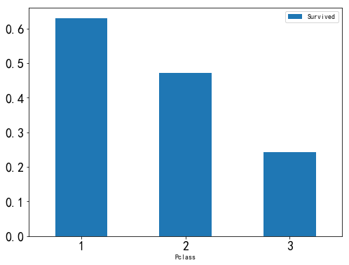

可以看到，等级越高的人，生存几率越大，那么ladyfirst能否跨越等级界限呢？

```python
df_psex = titanic[['Pclass', 'Sex', 'Survived']].groupby(['Pclass', 'Sex']).mean()
df_psex
```

<div>
<style scoped>
    .dataframe tbody tr th:only-of-type {
        vertical-align: middle;
    }

    .dataframe tbody tr th {
        vertical-align: top;
    }

    .dataframe thead th {
        text-align: right;
    }
</style>
<table border="1" class="dataframe">
  <thead>
    <tr style="text-align: right;">
      <th></th>
      <th></th>
      <th>Survived</th>
    </tr>
    <tr>
      <th>Pclass</th>
      <th>Sex</th>
      <th></th>
    </tr>
  </thead>
  <tbody>
    <tr>
      <th rowspan="2" valign="top">1</th>
      <th>female</th>
      <td>0.968085</td>
    </tr>
    <tr>
      <th>male</th>
      <td>0.368852</td>
    </tr>
    <tr>
      <th rowspan="2" valign="top">2</th>
      <th>female</th>
      <td>0.921053</td>
    </tr>
    <tr>
      <th>male</th>
      <td>0.157407</td>
    </tr>
    <tr>
      <th rowspan="2" valign="top">3</th>
      <th>female</th>
      <td>0.500000</td>
    </tr>
    <tr>
      <th>male</th>
      <td>0.135447</td>
    </tr>
  </tbody>
</table>
</div>

```python
df_psex.plot(kind='bar',
             rot=0,
             fontsize=12,
             figsize=(8,6))
plt.show()
```

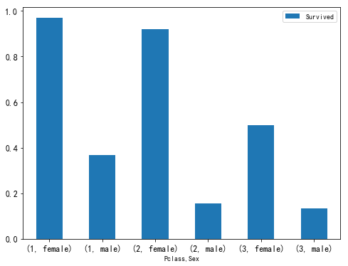

可以看到，ladyfirst确实跨越了社会等级界限，普通阶层的女性的生还率都高于精英阶层的男性生还率。
不过，无法忽视的是，不同等级的生还率还是有一定区别的。

### 年龄Age对生还与否的影响

绘图分析不同阶层和不同性别下的年龄分布情况以及与生还的关系

```python
# 绘图分析不同阶层和不同性别下的年龄分布情况以及与生还的关系

fig, ax = plt.subplots(1, 2, figsize=(18,8))
sns.violinplot('Pclass','Age', hue='Survived', data=titanic, split=True, ax=ax[0])
ax[0].set_title('Pclass and Age  vs  Survived',size=18)
ax[0].set_yticks(range(0, 110, 10))

sns.violinplot("Sex", "Age", hue="Survived", data=titanic, split=True, ax=ax[1])
ax[1].set_title('Sex and Age  vs  Survived',size=18)
ax[1].set_yticks(range(0, 110, 10))
plt.show()
```

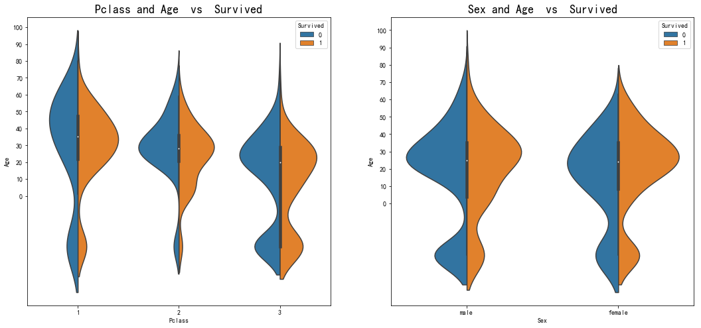

```python
# 统计总体的年龄分布
plt.figure(figsize=(10,6))
plt.subplot(1,2,1)
titanic['Age'].hist(bins=20)
plt.xlabel('Age')
plt.ylabel('Num')

plt.subplot(1,2,2)
titanic.boxplot(column='Age', showfliers=False)
plt.show()
```

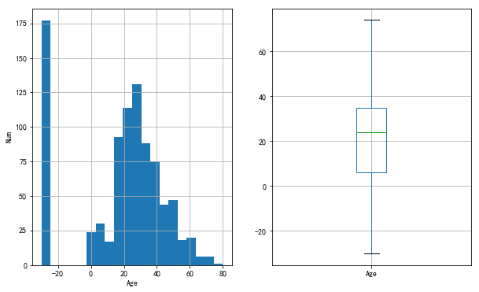

因为年龄缺失值填充的问题，所以中间高出很多

```python
page = sns.FacetGrid(titanic, hue="Survived",aspect=4)
page.map(sns.kdeplot,'Age',shade= True)
page.set(xlim=(-40, titanic['Age'].max()))
page.add_legend()
plt.show()
```

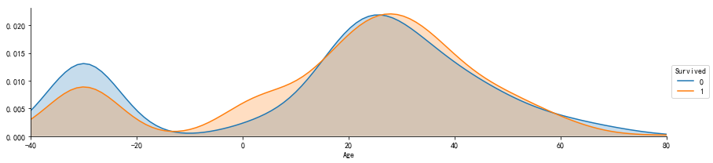

可以看到，孩子和中年人更容易获救。那么规则就是 **lady and children first**，缺省值中死亡更多
所以无法统计到年龄

```python
f, ax = plt.subplots(figsize=(8,3))
ax.set_title('Sex Age dist', size=20)
sns.distplot(titanic[titanic.Sex=='female'].dropna().Age, hist=False, color='pink', label='female')
sns.distplot(titanic[titanic.Sex=='male'].dropna().Age, hist=False, color='blue', label='male')
ax.legend(fontsize=15)
plt.show()
```

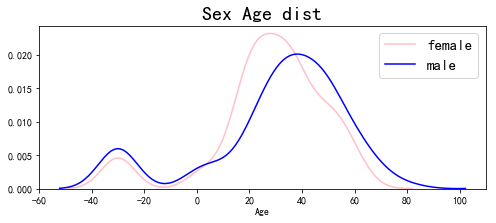

可以看到，女性更加年轻些，孩子和中老年人中男性更多

```python
f, ax = plt.subplots(figsize=(8,3))
ax.set_title('Pclass Age dist', size=20)
sns.distplot(titanic[titanic.Pclass==1].dropna().Age, hist=False, color='pink', label='P1',rug=True)
sns.distplot(titanic[titanic.Pclass==2].dropna().Age, hist=False, color='blue', label='p2',rug=True)
sns.distplot(titanic[titanic.Pclass==3].dropna().Age, hist=False, color='g', label='p3',rug=True)
ax.legend(fontsize=15)
plt.show()
```

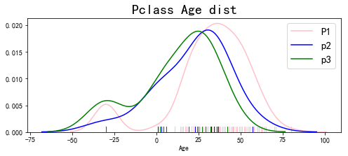

阶层越高，年纪更老龄化

### 有无兄弟姐妹 SibSp 对生还与否的影响

```python
# 首先将数据分为有兄弟姐妹和没有兄弟姐妹两组

df_sibsp = titanic[titanic['SibSp'] != 0]
df_sibsp_no = titanic[titanic['SibSp'] == 0]
```

```python
plt.figure(figsize=(12,6))
plt.subplot(1,2,1)
df_sibsp['Survived'].value_counts().plot(kind='pie',labels=['No Survived', 'Survived'], autopct = '%1.1f%%')
plt.xlabel('sibsp',fontsize=18)

plt.subplot(1,2,2)
df_sibsp_no['Survived'].value_counts().plot(kind='pie',labels=['No Survived', 'Survived'], autopct = '%1.1f%%')
plt.xlabel('sibsp_no',fontsize=18)

plt.show()
```


有了兄弟姐妹的帮助，似乎更能在险境中存活

### 有无父母孩子 Parch 对生还与否的影响

方法同上

```python
# 按照有无父母孩子分组
df_parch = titanic[titanic['Parch'] != 0]
df_parch_no = titanic[titanic['Parch'] == 0]

plt.figure(figsize=(12,6))
plt.subplot(1,2,1)
df_sibsp['Survived'].value_counts().plot(kind='pie',labels=['No Survived', 'Survived'], autopct = '%1.1f%%')
plt.xlabel('Parch',fontsize=18)

plt.subplot(1,2,2)
df_sibsp_no['Survived'].value_counts().plot(kind='pie',labels=['No Survived', 'Survived'], autopct = '%1.1f%%')
plt.xlabel('Parch_no',fontsize=18)

plt.show()
```

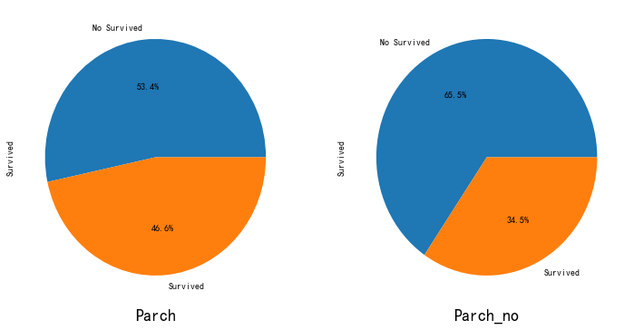

从之前的分析中知道，孩子是特殊照顾的对象，而孩子一般是有父母跟随的。即使都是成年人，互相帮助存活概率也更高。

### 亲人数量对生还与否的影响

是否亲人越多，生还可能性越大呢？

```python
fig,ax = plt.subplots(1, 2, figsize=(12,8))
titanic[['Parch','Survived']].groupby(['Parch']).mean().plot(kind='bar',ax=ax[0])
ax[0].set_title('Parch and Survived')

titanic[['SibSp','Survived']].groupby(['SibSp']).mean().plot.bar(ax=ax[1])
ax[1].set_title('SibSp and Survived')
plt.show()
```

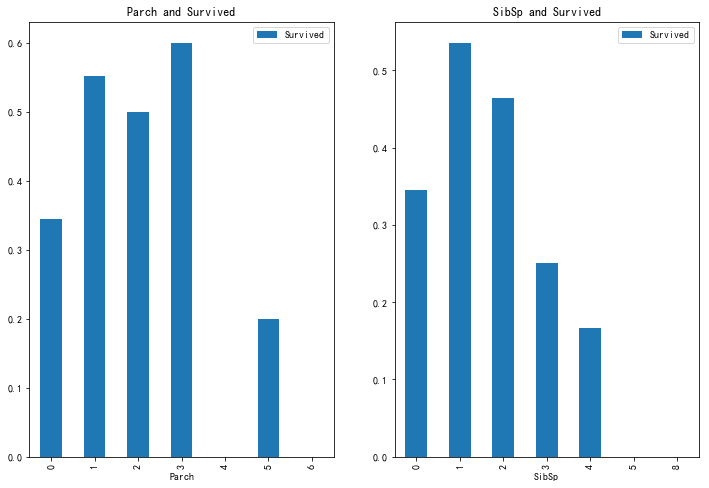

```python
titanic['fam_size'] = titanic['SibSp'] + titanic['Parch'] + 1
titanic[['fam_size','Survived']].groupby(['fam_size']).mean().plot.bar(figsize=(8,6))
plt.show()
```

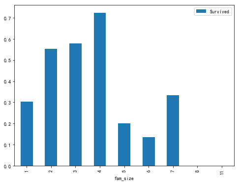

从上可以看出，家庭成员在1-4人生还率最高，推测应该是这样正好组成了可以互帮互助，行动又不臃肿从小组。
而后面7人家庭成员的存活率上升，推测应该是人数上升后，至少存活一人的概率增加。

### 票价 Fare 对生还与否的影响

```python
# 绘制票价分布图
titanic['Fare'].plot(kind='hist',bins=100,figsize=(10,6), grid=True)

titanic.boxplot(column='Fare', by='Pclass',showfliers=False,figsize=(10,6))
plt.show()
```

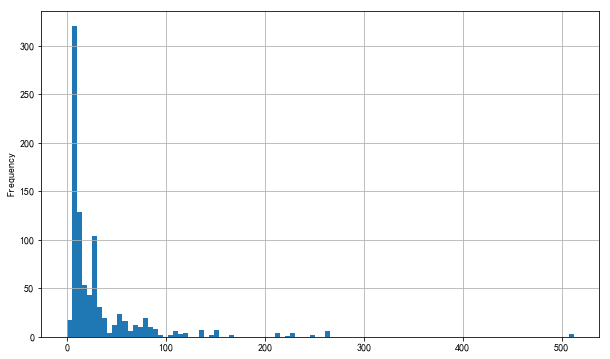

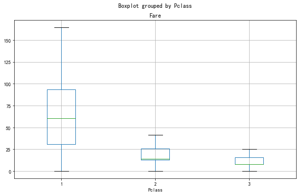

```python
titanic['Fare'].describe()
```

    count    891.000000
    mean      32.204208
    std       49.693429
    min        0.000000
    25%        7.910400
    50%       14.454200
    75%       31.000000
    max      512.329200
    Name: Fare, dtype: float64

```python
# 绘制生还者非生还者票价分析
titanic.boxplot(column='Fare', by='Survived',showfliers=False,showmeans=True)
```

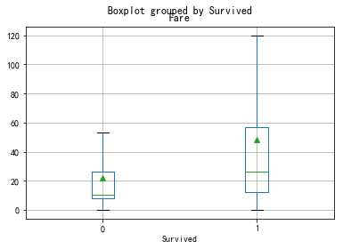

可以看到，幸存者的票价普遍更高，符合之前阶层越高，生还几率越大的推测

### 船舱号码 Cabin 对生还与否的影响

按照查询的资料，我认为乘客所处的船舱应该是跟是否生还有很大关系的，特别是下层的乘客，下部船舱快速进水，通向甲板的路不难想象也是混作一团，这就大大减少了生还可能。但是，此字段缺失数据多达600多个，所以只做下简单的数据分析。（不过我认为，票价和船舱应该有对应关系，如果能知道票价与船舱对应的史料就最好了）

```python
titanic.Cabin.isnull().value_counts()
```

    True     687
    False    204
    Name: Cabin, dtype: int64

```python
titanic.groupby(by=titanic.Cabin.isnull())['Survived'].mean()
```

    Cabin
    False    0.666667
    True     0.299854
    Name: Survived, dtype: float64

由上可知，缺失值的生存率很低，那么可以将**Cabin是否为空**作为一个特征！

```python
titanic['Cabin_fir'] = titanic.Cabin.fillna('0').str.split(' ').apply(lambda x: x[0][0])
df_cabin_fir = titanic.groupby(by='Cabin_fir')['Survived'].mean()
print(df_cabin_fir)

df_cabin_fir.plot(kind='bar',
                 rot=0,
                 legend=True,figsize=(10,8),
                 fontsize=12)
plt.show()
```

    Cabin_fir
    0    0.299854
    A    0.466667
    B    0.744681
    C    0.593220
    D    0.757576
    E    0.750000
    F    0.615385
    G    0.500000
    T    0.000000
    Name: Survived, dtype: float64

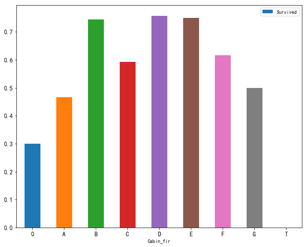

```python
df_cabin_fare = titanic.groupby(by='Cabin_fir')['Fare','Survived'].mean()
df_cabin_fare
```

<div>
<style scoped>
    .dataframe tbody tr th:only-of-type {
        vertical-align: middle;
    }

    .dataframe tbody tr th {
        vertical-align: top;
    }

    .dataframe thead th {
        text-align: right;
    }
</style>
<table border="1" class="dataframe">
  <thead>
    <tr style="text-align: right;">
      <th></th>
      <th>Fare</th>
      <th>Survived</th>
    </tr>
    <tr>
      <th>Cabin_fir</th>
      <th></th>
      <th></th>
    </tr>
  </thead>
  <tbody>
    <tr>
      <th>0</th>
      <td>19.157325</td>
      <td>0.299854</td>
    </tr>
    <tr>
      <th>A</th>
      <td>39.623887</td>
      <td>0.466667</td>
    </tr>
    <tr>
      <th>B</th>
      <td>113.505764</td>
      <td>0.744681</td>
    </tr>
    <tr>
      <th>C</th>
      <td>100.151341</td>
      <td>0.593220</td>
    </tr>
    <tr>
      <th>D</th>
      <td>57.244576</td>
      <td>0.757576</td>
    </tr>
    <tr>
      <th>E</th>
      <td>46.026694</td>
      <td>0.750000</td>
    </tr>
    <tr>
      <th>F</th>
      <td>18.696792</td>
      <td>0.615385</td>
    </tr>
    <tr>
      <th>G</th>
      <td>13.581250</td>
      <td>0.500000</td>
    </tr>
    <tr>
      <th>T</th>
      <td>35.500000</td>
      <td>0.000000</td>
    </tr>
  </tbody>
</table>
</div>

在有记录的乘客中，可以发现，BC舱位总统套间，掏钱最多，DE为贵宾舱，费用中等，其余为普通舱。生还率大致符合阶层的情况。至于为何C舱生还率
低于BDE，暂不分析，推测应该与所处舱位位置不佳，男性占比大，年龄偏大有关。

### 登船地点 Embarked 对生还与否的影响

> 泰坦尼克号从英国南安普敦出发，途经法国瑟堡-奥克特维尔以及爱尔兰昆士敦 —— 百度百科

南安普顿对应 S = Southampton， 瑟堡-奥克特维尔对应 C = Cherbourg，昆士敦对应 Q = Queenstown

```python
titanic.groupby(by='Embarked')['Survived'].mean().plot(kind='bar', rot=0, fontsize=15, legend=True)
plt.show()
```

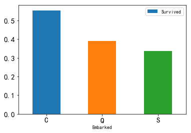

```python
df_embarked = titanic.groupby(by='Embarked')['Survived','Fare'].agg(['mean', 'count'])
df_embarked
```

<div>
<style scoped>
    .dataframe tbody tr th:only-of-type {
        vertical-align: middle;
    }

    .dataframe tbody tr th {
        vertical-align: top;
    }

    .dataframe thead tr th {
        text-align: left;
    }

    .dataframe thead tr:last-of-type th {
        text-align: right;
    }
</style>
<table border="1" class="dataframe">
  <thead>
    <tr>
      <th></th>
      <th colspan="2" halign="left">Survived</th>
      <th colspan="2" halign="left">Fare</th>
    </tr>
    <tr>
      <th></th>
      <th>mean</th>
      <th>count</th>
      <th>mean</th>
      <th>count</th>
    </tr>
    <tr>
      <th>Embarked</th>
      <th></th>
      <th></th>
      <th></th>
      <th></th>
    </tr>
  </thead>
  <tbody>
    <tr>
      <th>C</th>
      <td>0.553571</td>
      <td>168</td>
      <td>59.954144</td>
      <td>168</td>
    </tr>
    <tr>
      <th>Q</th>
      <td>0.389610</td>
      <td>77</td>
      <td>13.276030</td>
      <td>77</td>
    </tr>
    <tr>
      <th>S</th>
      <td>0.336957</td>
      <td>644</td>
      <td>27.079812</td>
      <td>644</td>
    </tr>
  </tbody>
</table>
</div>

```python
ax = plt.figure(figsize=(10,6)).add_subplot(111)
ax.set_xlim([-40, 80])
sns.kdeplot(titanic[titanic.Embarked=='C'].Age, ax=ax, label='C')
sns.kdeplot(titanic[titanic.Embarked=='Q'].Age, ax=ax, label='Q')
sns.kdeplot(titanic[titanic.Embarked=='S'].Age, ax=ax, label='S')
ax.legend(fontsize=18)
plt.show()
```

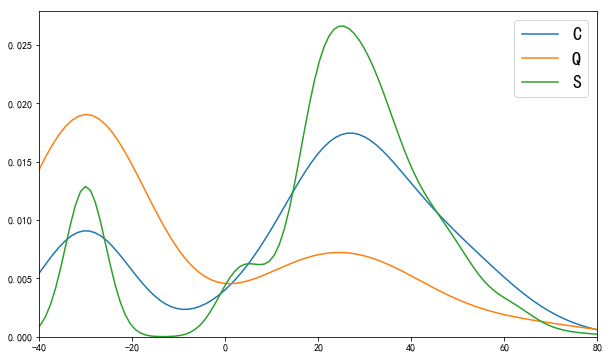

C和S上岸的乘客的年龄分布较为相似，Q上岸的人很多没有年龄。
C和S比较，C口岸的人中有更多的孩子和老人

### 名字 Name 对生还与否的影响
通过对名字该字段的初步观察，发现名字中不但透漏出性别，还代表着一个人的地位，年龄，职业等
比如Master，Miss等

```python
# 称谓统计
titanic['Title'] = titanic.Name.apply(lambda x: x.split(',')[1].split('.')[0])
titanic['Title'].value_counts()
```

     Mr              517
     Miss            182
     Mrs             125
     Master           40
     Dr                7
     Rev               6
     Mlle              2
     Major             2
     Col               2
     the Countess      1
     Don               1
     Jonkheer          1
     Mme               1
     Capt              1
     Sir               1
     Lady              1
     Ms                1
    Name: Title, dtype: int64

```python
# 姓氏统计
titanic.Name.apply(lambda x: x.split(',')[1].split('.')[1]).value_counts()[:10]
```

     John             9
     James            7
     Mary             6
     William          6
     William Henry    4
     Bertha           4
     Ivan             4
     William John     4
     Samuel           3
     Patrick          3
    Name: Name, dtype: int64


```python
titanic[['Title','Survived']].groupby(['Title']).mean()
```

<div>
<style scoped>
    .dataframe tbody tr th:only-of-type {
        vertical-align: middle;
    }

    .dataframe tbody tr th {
        vertical-align: top;
    }

    .dataframe thead th {
        text-align: right;
    }
</style>
<table border="1" class="dataframe">
  <thead>
    <tr style="text-align: right;">
      <th></th>
      <th>Survived</th>
    </tr>
    <tr>
      <th>Title</th>
      <th></th>
    </tr>
  </thead>
  <tbody>
    <tr>
      <th>Capt</th>
      <td>0.000000</td>
    </tr>
    <tr>
      <th>Col</th>
      <td>0.500000</td>
    </tr>
    <tr>
      <th>Don</th>
      <td>0.000000</td>
    </tr>
    <tr>
      <th>Dr</th>
      <td>0.428571</td>
    </tr>
    <tr>
      <th>Jonkheer</th>
      <td>0.000000</td>
    </tr>
    <tr>
      <th>Lady</th>
      <td>1.000000</td>
    </tr>
    <tr>
      <th>Major</th>
      <td>0.500000</td>
    </tr>
    <tr>
      <th>Master</th>
      <td>0.575000</td>
    </tr>
    <tr>
      <th>Miss</th>
      <td>0.697802</td>
    </tr>
    <tr>
      <th>Mlle</th>
      <td>1.000000</td>
    </tr>
    <tr>
      <th>Mme</th>
      <td>1.000000</td>
    </tr>
    <tr>
      <th>Mr</th>
      <td>0.156673</td>
    </tr>
    <tr>
      <th>Mrs</th>
      <td>0.792000</td>
    </tr>
    <tr>
      <th>Ms</th>
      <td>1.000000</td>
    </tr>
    <tr>
      <th>Rev</th>
      <td>0.000000</td>
    </tr>
    <tr>
      <th>Sir</th>
      <td>1.000000</td>
    </tr>
    <tr>
      <th>the Countess</th>
      <td>1.000000</td>
    </tr>
  </tbody>
</table>
</div>

```python
# 不同称呼的生存率统计
titanic[['Title','Survived']].groupby(['Title']).mean().plot.bar(rot=45, figsize=(15,6), fontsize=12)
plt.show()
```

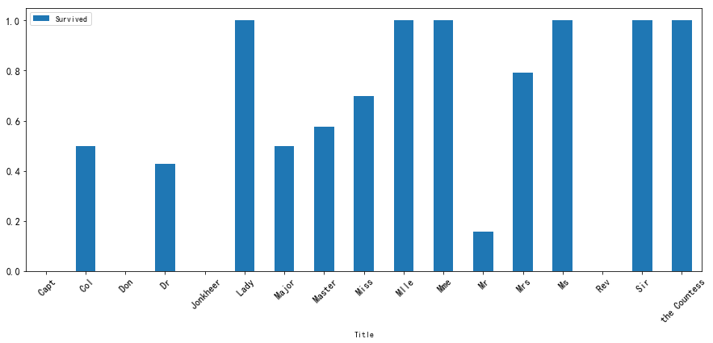

可以看到，称谓确实与获救率有关，以为称谓往往与人的性别，地位有关。

换个角度，我们知道，歪果仁的名字中通常会加入家族名字，爵位等，所以是不是名字越长就越能像是一个家族的历史和地位呢？**那么名字的长短是否能够显示出人的地位从而影响到是否获救？**

```python
titanic['name_len'] = titanic['Name'].apply(len)
df_namelen = titanic[['name_len','Survived']].groupby(['name_len'],as_index=False).mean()
df_namelen.plot.bar(x='name_len',y='Survived',figsize=(18,6),rot=0,colormap='Blues_r',alpha=0.6,fontsize=12)
plt.show()
```

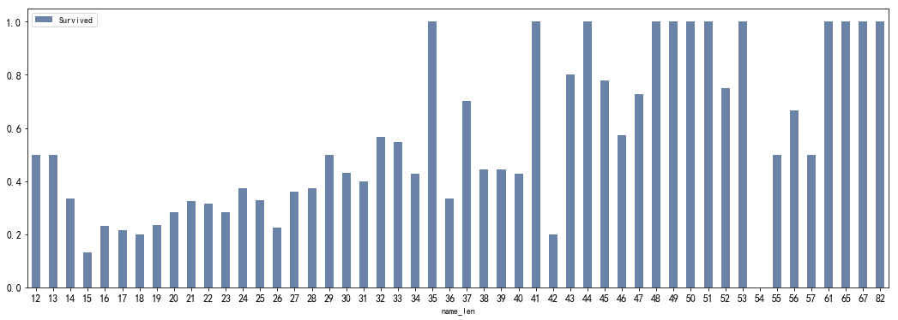

看来猜想是正确的，名字的长度确实与是否获救有一定关系

### Ticket

类别比较大，观察可以发现，票号开头应该代表着船舱区域，故提取分析

```python
titanic['Ticket_Lett'] = titanic['Ticket'].apply(lambda x: str(x)[0])
titanic['Ticket_Lett'] = titanic['Ticket_Lett'].apply(lambda x: str(x))
titanic.groupby(titanic['Ticket_Lett'])['Survived'].mean()
```

    Ticket_Lett
    1    0.630137
    2    0.464481
    3    0.239203
    4    0.200000
    5    0.000000
    6    0.166667
    7    0.111111
    8    0.000000
    9    1.000000
    A    0.068966
    C    0.340426
    F    0.571429
    L    0.250000
    P    0.646154
    S    0.323077
    W    0.153846
    Name: Survived, dtype: float64

```python
titanic.groupby(titanic['Ticket_Lett'])['Survived'].mean().plot.bar(rot=0)
```

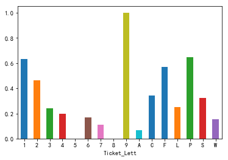

可以看到，船票不同开头的生存率不同，可以作为一个特征

通过以上的分析，我们发现，乘客获救与否，与多种因素有关。包括性别，年龄，阶级等。在这大灾难面前，强壮的男人死亡率反常的高，而女人和孩子反而更易存活，这不正常，但也是正常的，这应该就是文明发展的结果。

那么，如果你当时在泰坦尼克上，你是否会成功获救呢？下篇文章，将通过机器学习算法，来预测另一批乘客是否会活下来。

## 特征工程

### 变量转换

> 变量转换的目的是将数据转换为适用于模型使用的数据，不同模型接受不同类型的数据，**Scikit-learn要求数据都是数字型numeric**，所以我们要将一些非数字型的原始数据转换为数字型numeric

```python
from sklearn.preprocessing import LabelEncoder
from sklearn.model_selection import train_test_split
from sklearn.linear_model import LogisticRegression
from sklearn.svm import SVC
from sklearn.ensemble import RandomForestClassifier
from sklearn.neighbors import KNeighborsClassifier
from sklearn.tree import DecisionTreeClassifier
from xgboost import XGBClassifier
import warnings
warnings.filterwarnings('ignore')
```

```python
os.chdir('E:\DataScience\ML\Titanic')
data_train = pd.read_csv('train.csv')
data_test = pd.read_csv('test.csv')
combine = pd.concat([data_train,data_test])
```

对数据进行特征工程，也就是从各项参数中提取出对输出结果有或大或小的影响的特征，将这些特征作为训练模型的依据。 一般来说，我们会先从含有缺失值的特征开始

### Embarked

因为该项的缺失值没几个，所以这里我们以众数来填充：

```python
# 缺失值填充，众数为 S
combine['Embarked'] = combine['Embarked'].fillna('S')

# dummy处理
df = pd.get_dummies(combine['Embarked'], prefix='Embarked')
combine = pd.concat([combine, df], axis=1).drop('Embarked', axis=1)

```

### Name_length

```python
combine['Name_length'] = combine['Name'].apply(len)
```

### Title

```python
combine['Title'] = combine['Name'].apply(lambda x: x.split(',')[1]).apply(lambda x:x.split('.')[0])
combine['Title'] = combine['Title'].apply(lambda x: x.strip())
combine['Title'] = combine['Title'].replace(['Major','Capt','Rev','Col','Dr'],'officer')
combine['Title'] = combine['Title'].replace(['Mlle','Miss'], 'Miss')
combine['Title'] = combine['Title'].replace(['Mme','Ms','Mrs'], 'Mrs')
combine['Title'] = combine['Title'].replace(['Master','Jonkheer'], 'Master')
combine['Title'] = combine['Title'].replace(['Don', 'Sir', 'the Countess', 'Dona', 'Lady'], 'Royalty')
df = pd.get_dummies(combine['Title'],prefix='Title')
combine = pd.concat([combine,df], axis=1)

```

### Fare

该项只有一个缺失值，对该值进行填充,我们可以按照阶级均价来填充

```python
combine['Fare'] = combine['Fare'].fillna(combine.groupby('Pclass')['Fare'].transform(np.mean))
```

通过对Ticket简单的统计，我们可以看到部分票号数据有重复，同时结合亲属人数及名字的数据，和票价船舱等级对比，我们可以知道购买的票中有团体票，所以我们需要将团体票的票价分配到每个人的头上

```python
combine['Group_Ticket'] = combine['Fare'].groupby(by=combine['Ticket']).transform('count')
combine['Fare'] = combine['Fare'] / combine['Group_Ticket']
combine.drop(['Group_Ticket'], axis=1, inplace=True)
```

```python
#  分级
combine['Fare_1'] = np.where(combine['Fare'] <= 7.91,1,0)
combine['Fare_2'] = np.where((combine['Fare'] > 7.91) & (combine['Fare'] <= 14.454),1,0)
combine['Fare_3'] = np.where((combine['Fare'] > 14.454)& (combine['Fare'] <= 31),1,0)
combine['Fare_4'] = np.where((combine['Fare'] > 31),1,0)
combine = combine.drop('Fare',axis=1)
```

### Dead_female_family & Survive_male_family

前面分析可以知道，家庭的行为具有一致性，那么如果家族中有一个女的死亡，那么其他女性也倾向于死亡，反之，如果有男性生还，其他男性也会倾向于生还，为了防止模型无脑判断女性生还和男性死亡，在这里分出这两类情况。

```python
combine['Fname'] = combine['Name'].apply(lambda x:x.split(',')[0])
combine['Familysize'] = combine['SibSp']+combine['Parch']
dead_female_Fname = list(set(combine[(combine.Sex=='female') & (combine.Age>=12) & (combine.Survived==0) & (combine.Familysize>1)]['Fname'].values))
survive_male_Fname = list(set(combine[(combine.Sex=='male') & (combine.Age>=12) & (combine.Survived==1) & (combine.Familysize>1)]['Fname'].values))
combine['Dead_female_family'] = np.where(combine['Fname'].isin(dead_female_Fname),1,0)
combine['Survive_male_family'] = np.where(combine['Fname'].isin(survive_male_Fname),1,0)
combine = combine.drop(['Name','Fname','Familysize'],axis=1)
```

### Age

Age缺失值太多，可以按照阶级性别的平均年龄填充，也可以利用机器学习算法来预测,这里我们采用第一种方法

```python
group = combine.groupby(['Title', 'Pclass'])['Age']
combine['Age'] = group.transform(lambda x: x.fillna(x.median()))
combine['IsChild'] = np.where(combine['Age']<=12,1,0)
# combine['Age'] = pd.cut(combine['Age'],5)
combine = combine.drop(['Title'],axis=1)
```

### Cabin

Cabin的缺失值太多，但是根据之前的分析，该特征值的有无与生还与否也相关性，所以我们将其分为两类

```python
combine['Cabin_0'] = np.where(combine['Cabin'].isnull(),1,0)
combine['Cabin_1'] = np.where(combine['Cabin'].isnull(),0,1)
combine = combine.drop('Cabin',axis=1)
```

### Pclass

Pclass这一项，只需要将其转换为dummy形式就可以了

```python
df = pd.get_dummies(combine['Pclass'], prefix='Pclass')
combine = pd.concat([combine, df], axis=1).drop('Pclass',axis=1)
```

### Ticket

Ticket 在前面并没有分析，主要是因为里面有英文有数字，难以分析出规律，但是只看英文数字结合的票号，不难发现，票号前面的英文应该代表着位置信息，那么位置影响逃生路线，故将这部分提取出来做特征处理

```python
combine['Ticket_Lett'] = combine['Ticket'].apply(lambda x: str(x)[0])
combine['Ticket_Lett'] = combine['Ticket_Lett'].apply(lambda x: str(x))

combine['High_Survival_Ticket'] = np.where(combine['Ticket_Lett'].isin(['1', '2', 'P','9','F']),1,0)
combine['mid_Survival_Ticket'] = np.where(combine['Ticket_Lett'].isin(['3','4','L','S']),1,0)
combine['Low_Survival_Ticket'] = np.where(combine['Ticket_Lett'].isin(['A','W','6','7']),1,0)
combine = combine.drop(['Ticket','Ticket_Lett'],axis=1)
```

### Sex

对Sex进行one-hot编码

```python
df = pd.get_dummies(combine['Sex'], prefix='Sex')
combine = pd.concat([combine, df],axis=1).drop('Sex',axis=1)
```

### Parch and SibSp

亲友数量是会影响到生存率的，那么将这两项合为一项

```python
combine['Family_size'] = np.where((combine['Parch']+combine['SibSp']==0),'Alone',
                                  np.where((combine['Parch']+combine['SibSp']<=3),'Small','Big'))

df = pd.get_dummies(combine['Family_size'], prefix='Family_size')
combine = pd.concat([combine,df],axis=1).drop(['SibSp','Parch','Family_size'],axis=1)
```

### 将所有特征转换正数值型编码

```python
features = combine.drop(["PassengerId","Survived"], axis=1).columns
le = LabelEncoder()
for feature in features:
    le = le.fit(combine[feature])
    combine[feature] = le.transform(combine[feature])
```

### 将训练数据和测试数据分开

```python
x_train = combine.iloc[:891,:].drop(['PassengerId', 'Survived'],axis=1)
y_train = combine.iloc[:891,:]['Survived']
x_test = combine.iloc[891:,:].drop(['PassengerId','Survived'], axis=1)
```

### 模型比较

```python
# logistic Regression
Logreg = LogisticRegression()
Logreg.fit(x_train,y_train)
y_pred = Logreg.predict(x_test)
acc_logreg = round(Logreg.score(x_train, y_train) * 100,2)

# Support Vector Machines
svc = SVC()
svc.fit(x_train, y_train)
y_pred = svc.predict(x_test)
acc_svc = round(svc.score(x_train, y_train) *100,2)

# K-Nearest Neighbors
knn = KNeighborsClassifier(n_neighbors=3)
knn.fit(x_train, y_train)
y_pred = knn.predict(x_test)
acc_knn = round(knn.score(x_train, y_train) * 100, 2)

# Random Forest
rf = RandomForestClassifier(n_estimators=100)
rf.fit(x_train, y_train)
y_pred = rf.predict(x_test)
acc_rf = round(rf.score(x_train, y_train) * 100, 2)

# Decision Tree
dec_tree = DecisionTreeClassifier()
dec_tree.fit(x_train, y_train)
y_pred = dec_tree.predict(x_test)
acc_dec_tree = round(dec_tree.score(x_train,y_train) * 100,2)


# XGBoost
xgb = XGBClassifier(max_depth=3, n_estimators=300, learning_rate=0.03)
xgb.fit(x_train,y_train)
y_pred = xgb.predict(x_test)
acc_xgb = round(xgb.score(x_train,y_train) * 100, 2)


models = pd.DataFrame({'model':['Logreg','svc','knn','rf','dec_tree','xgb'],
                       'Score':[acc_logreg,acc_svc,acc_knn,acc_rf,acc_dec_tree,acc_xgb]})

print(models.sort_values(by='Score', ascending=False))
```

       Score     model
    4  99.21  dec_tree
    3  99.10        rf
    5  88.55       xgb
    2  87.32       knn
    1  87.09       svc
    0  86.31    Logreg

```python
# XGB
xgb = XGBClassifier(max_depth=3, n_estimators=300, learning_rate=0.03)
xgb.fit(x_train,y_train)
y_pred = xgb.predict(x_test)
```

```python
subminssion = pd.DataFrame({"PassengerId": data_test["PassengerId"],"Survived": y_pred})
subminssion.to_csv('submission.csv',index=False)
```
